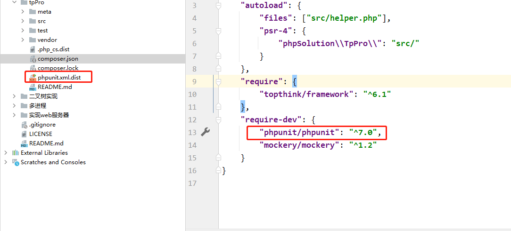
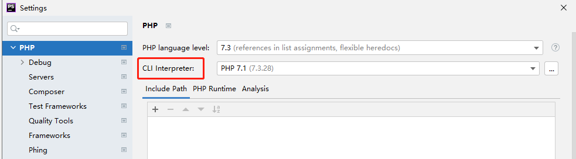
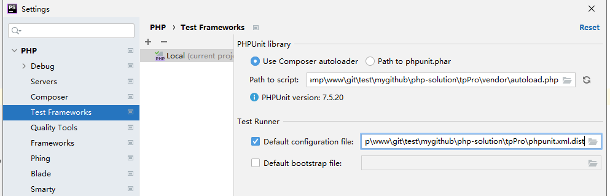

Tp项目一些封装公共代码 演示代码基于tp6

### 开发说明

```shell
composer init

composer require topthink/framework
```

```shell
# composer 更新autoloader
composer dump-autoload -o
```

### 代码格式化 (需自行安装 php-cs-fixer)

```shell 
php-cs-fixer fix .
```

### 关于phpstorm配置phpunit

1：composer 安装phpunit 组件



2: 配置php解释器



3: Test Frameworks 配置phpunit



### 使用说明

##### 1:自定义日志驱动

ESLog: 日志输出为指定格式，通过logstash采集

DbLog: highLevel日志记录日志表，同时保持tp原有日志格式


